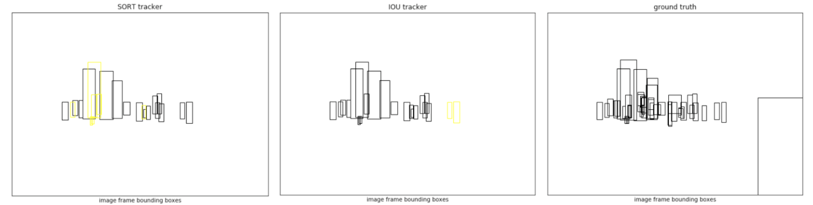

# pyTracking

This repo is a collection of trackers for Multi-Object Tracking by Detection. 

Additionally, they are modified for purpose of online tracking, with results to be stored for downstream applications (e.g. analytics). 

As such, it will differ from code provided by original authors as it is not intended for MOT challenge or other benchmarking format. 

## Install

````
pip install -r requirements.txt
````

## Usage

````
from tracking.iou import IOUTracker
tracker = IOUTracker()

# update tracker with a list of detection objects
# this is performed at each frame 
tracker.track(detections)

# get list of active tracks 
tracks = tracker.get_tracks()

# get track as a dict
tracks[0].to_dict()

{'track_id': 'aab1fb',
 'box': array([659. , 450. , 757. , 735.6]),
 'score': 1.0,
 'status': 1,
 'frames': 99} 
````

## Trackers

Original code for available trackers from source where cited. 
The trackers are modified for the purposes of this repo. 

````
# High-Speed Tracking-by-Detection Without Using Image Information by E. Bochinski, V. Eiselein, T. Sikora
# http://elvera.nue.tu-berlin.de/files/1517Bochinski2017.pdf.

from tracking.iou import IOUTracker
tracker = IOUTracker()


# Simple online and real-time tracking by Bewley, et al. 
# http://arxiv.org/abs/1602.00763

from tracking.sort import SortTracker
tracker = SortTracker()

````

Sample image below (yellow denotes new track)



## LICENSE

MIT Licensed
